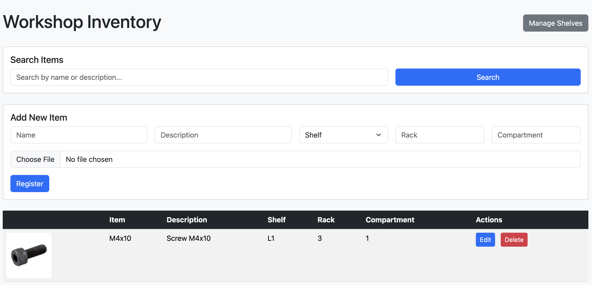

# Workshop Inventory System

A simple and efficient inventory management system for workshops, built with Go and Bootstrap.



## Features

- 📦 **Item Management**
  - Add, edit, and delete items
  - Organize items by shelf, rack, and compartment
  - Search items by name or description
  - Photo upload with thumbnail generation
  - Hover preview for item photos

- 📚 **Shelf Management**
  - Create and manage shelves
  - Edit shelf names
  - Delete shelves

- 🖼️ **Photo Features**
  - Upload photos for items
  - Automatic thumbnail generation
  - Hover preview at 60% of original size
  - Click to view full-size image

## Requirements

- Go 1.16 or higher
- Go modules enabled

## Installation

1. Clone the repository:
```bash
git clone https://github.com/yourusername/workshop-inventory.git
cd workshop-inventory
```

2. Install dependencies:
```bash
go mod tidy
```

3. Run the application:
```bash
go run main.go
```

The application will be available at `http://localhost:8080`

## Project Structure

```
workshop-inventory/
├── main.go              # Main application code
├── templates/           # HTML templates
│   ├── index.html      # Main inventory page
│   └── estantes.html   # Shelves management page
├── static/             # Static files
│   └── photos/         # Uploaded photos
│       └── thumbs/     # Generated thumbnails
└── dados.json          # Data storage
```

## Usage

### Managing Items

1. **Adding Items**
   - Fill in the item details (name, description, location)
   - Upload a photo (optional)
   - Click "Cadastrar" to save

2. **Editing Items**
   - Click the "Editar" button next to an item
   - Modify the details in the modal form
   - Upload a new photo if needed
   - Click "Salvar" to update

3. **Deleting Items**
   - Click the "Excluir" button next to an item
   - Confirm the deletion

4. **Searching Items**
   - Use the search box at the top
   - Search by name or description
   - Results update in real-time

### Managing Shelves

1. **Adding Shelves**
   - Click "Gerenciar Estantes"
   - Enter the shelf name
   - Click "Adicionar"

2. **Editing Shelves**
   - Click "Editar" next to a shelf
   - Modify the name
   - Click "Salvar"

3. **Deleting Shelves**
   - Click "Excluir" next to a shelf
   - Confirm the deletion

## Photo Management

- Photos are automatically resized and thumbnails are generated
- Hover over thumbnails to see a larger preview
- Click thumbnails to view the full-size image
- Photos are stored in the `static/photos` directory
- Thumbnails are stored in `static/photos/thumbs`

## Contributing

1. Fork the repository
2. Create a feature branch
3. Commit your changes
4. Push to the branch
5. Create a Pull Request

## License

This project is licensed under the MIT License - see the LICENSE file for details. 
