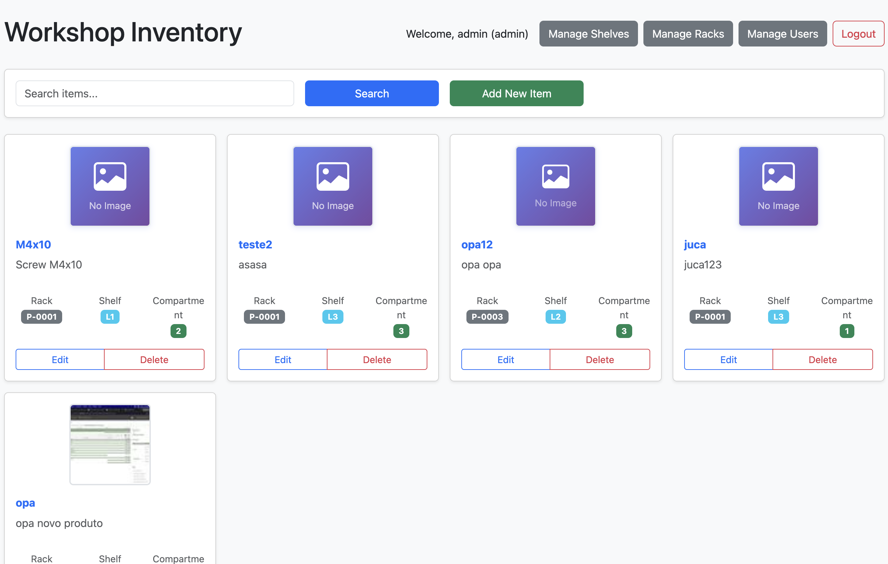

# Workshop Inventory System

A comprehensive inventory management system for workshops, built with Go and featuring a modern web interface.



## TODO
- **Database JSON to MySQL or PGSQL**

## Features

- **User Management**
  - Role-based access control (Admin/Viewer)
  - User profile photos
  - Secure authentication
  - User creation, editing, and deletion (admin only)

- **Inventory Management**
  - Add, edit, and delete items
  - Item photos with thumbnails
  - Search functionality
  - Pagination support

- **Shelf Management**
  - Organize items by shelves
  - Add, edit, and delete shelves
  - Track item locations

- **Modern UI**
  - Responsive design
  - Photo previews
  - Intuitive navigation
  - Bootstrap 5 styling

## Configuration

The system uses `config.json` for configuration:

```json
{
  "title": "Workshop Inventory",
  "items_per_page": 10,
  "photo_thumbnail_size": 100,
  "photo_preview_size": 600,
  "session_timeout": 3600,
  "max_login_attempts": 5,
  "lockout_duration": 300
}
```

## Installation

1. Clone the repository:
   ```bash
   git clone https://github.com/yourusername/workshop-inventory.git
   cd workshop-inventory
   ```

2. Install dependencies:
   ```bash
   go get github.com/gorilla/sessions
   go get github.com/nfnt/resize
   ```

3. Create required directories:
   ```bash
   mkdir -p static/photos static/photos/thumbs
   ```

4. Run the application:
   ```bash
   go run main.go
   ```

The server will start on port 8080.

## First-Time Setup

1. The system creates a default admin user on first run:
   - Username: `admin`
   - Password: `admin`

2. Log in and change the default admin password immediately.

3. Create additional users as needed through the user management interface.

## Usage

### Admin Features
- Manage inventory items
- Manage shelves
- Manage users
- Full access to all system features

### Viewer Features
- View inventory
- Search items
- View item details
- No modification rights

## Security

- Role-based access control
- Session management
- Secure file handling
- Input validation
- XSS protection

## File Structure

```
workshop-inventory/
├── main.go              # Main application code
├── config.json          # Configuration file
├── dados.json           # Inventory data
├── usuarios.json        # User data
├── static/              # Static files
│   └── photos/          # Item and user photos
│       └── thumbs/      # Photo thumbnails
└── templates/           # HTML templates
    ├── index.html       # Main inventory page
    ├── login.html       # Login page
    ├── usuarios.html    # User management page
    └── estantes.html    # Shelf management page
```

## Contributing

1. Fork the repository
2. Create a feature branch
3. Commit your changes
4. Push to the branch
5. Create a Pull Request

## License

This project is licensed under the MIT License - see the LICENSE file for details. 
