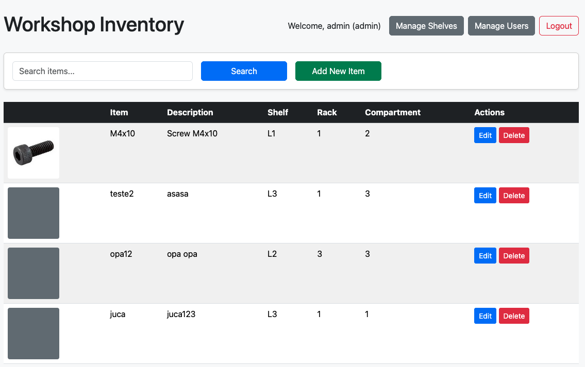

# Workshop Inventory System

A comprehensive inventory management system for workshops, built with Go and featuring a modern web interface.



## 🚀 Quick Start (Docker)

The easiest way to run the application is using Docker:

```bash
# Complete setup in one command
make setup

# Or step by step:
make init-data  # Initialize data files if they don't exist
make dev        # Start development environment
```

**Access URLs:**
- **Application**: http://localhost:9090
- **File Browser** (debug): http://localhost:9091 (use `make debug`)

## 📋 Available Commands

```bash
make help       # Show all available commands
make dev        # Start development environment
make debug      # Start with debug tools (file browser)
make logs       # Show application logs
make restart    # Restart application
make down       # Stop all services
make clean      # Clean containers and volumes
make shell      # Access container shell
make status     # Show container status
```

## TODO
- **Database JSON to MySQL or PGSQL**
- **Translate portuguese to english some parts of the code**

## Features

- **User Management**
  - Role-based access control (Admin/Viewer)
  - User profile photos
  - Secure authentication
  - User creation, editing, and deletion (admin only)

- **Inventory Management**
  - Add, edit, and delete items
  - Item photos with thumbnails
  - Search functionality
  - Pagination support
  - Three-level location system: **Rack → Shelf → Compartment**

- **Location Management**
  - **Rack Management**: Create and manage racks (numerical: 1, 2, 3...)
  - **Shelf Management**: Create and manage shelves (alphanumeric: L1, L2, L3...)
  - **Hierarchical organization**: Rack → Shelf → Compartment
  - Add, edit, and delete both racks and shelves
  - Automatic updates when locations are modified

- **Modern UI**
  - Responsive design
  - Photo previews
  - Intuitive navigation
  - Bootstrap 5 styling
  - Inline editing for locations

## Configuration

The system uses `config.json` for configuration:

```json
{
  "title": "Workshop Inventory",
  "items_per_page": 10,
  "photo_thumbnail_size": 100,
  "photo_preview_size": 600,
  "session_timeout": 3600,
  "max_login_attempts": 5,
  "lockout_duration": 300
}
```

## Installation

### Option 1: Docker (Recommended)

1. Clone the repository:
   ```bash
   git clone https://github.com/yourusername/workshop-inventory.git
   cd workshop-inventory
   ```

2. Start the application:
   ```bash
   make setup
   ```

3. Access: http://localhost:9090

### Option 2: Local Development

1. Clone the repository:
   ```bash
   git clone https://github.com/yourusername/workshop-inventory.git
   cd workshop-inventory
   ```

2. Install dependencies:
   ```bash
   go get github.com/gorilla/sessions
   go get github.com/nfnt/resize
   go get golang.org/x/crypto
   ```

3. Create required directories:
   ```bash
   mkdir -p static/photos static/photos/thumbs
   ```

4. Run the application:
   ```bash
   go run main.go
   ```

The server will start on port 8080.

## First-Time Setup

1. The system creates a default admin user on first run:
   - Username: `admin`
   - Password: `admin`

2. Log in and change the default admin password immediately.

3. Create additional users as needed through the user management interface.

## Usage

### Admin Features
- Manage inventory items (add, edit, delete)
- Manage racks (numerical organization)
- Manage shelves (alphanumeric organization)  
- Manage users (create, edit, delete)
- Upload and manage item photos
- Full access to all system features

### Viewer Features
- View inventory with search and pagination
- Browse items by location (Rack → Shelf → Compartment)
- View item details and photos
- No modification rights

## Security

- Role-based access control
- Session management
- Secure file handling
- Input validation
- XSS protection

## File Structure

```
workshop-inventory/
├── main.go              # Main application code
├── config.json          # Configuration file
├── dados.json           # Inventory data (items, shelves, racks)
├── usuarios.json        # User data
├── docker-compose.yml   # Docker configuration
├── Dockerfile          # Docker build instructions
├── Makefile            # Development commands
├── DEV.md              # Development documentation
├── static/              # Static files
│   └── photos/          # Item and user photos
│       └── thumbs/      # Photo thumbnails
└── templates/           # HTML templates
    ├── index.html       # Main inventory page
    ├── login.html       # Login page
    ├── novo_item.html   # Add new item page
    ├── editar_item.html # Edit item page
    ├── usuarios.html    # User management page
    ├── estantes.html    # Shelf management page
    └── racks.html       # Rack management page
```

## Data Structure

The system organizes inventory using a three-level hierarchy:

1. **Rack** (`prateleira`): Numerical identifier (1, 2, 3, 4, 5...)
2. **Shelf** (`estante`): Alphanumeric identifier (L1, L2, L3...)  
3. **Compartment** (`compartimento`): Final location identifier

### Example Item Location:
- **Rack**: 2
- **Shelf**: L1  
- **Compartment**: 3
- **Full Address**: "Rack 2, Shelf L1, Compartment 3"

## Development

### Docker Development Environment

The project includes a complete Docker development setup:

- **Hot-reload**: Templates are updated automatically
- **Persistent data**: Data files are mounted as volumes  
- **Health checks**: Automatic application monitoring
- **Debug tools**: Optional file browser for debugging

### Development Workflow

1. **Start development environment**: `make dev`
2. **View logs**: `make logs` 
3. **Restart after Go changes**: `make restart`
4. **Debug with file browser**: `make debug`
5. **Clean everything**: `make clean`

### File Changes

- **Templates**: Auto-reload (no restart needed)
- **Go code**: Requires `make restart` 
- **Data files**: Persistent across restarts
- **Static files**: Auto-sync with container

## Contributing

1. Fork the repository
2. Create a feature branch
3. Commit your changes
4. Push to the branch
5. Create a Pull Request

## Troubleshooting

- **Permission errors on photos**: `chmod -R 755 static/`
- **App won't start**: Check if port 9090 is free
- **View detailed logs**: `make logs`
- **Complete reset**: `make clean && make setup`

## License

This project is licensed under the MIT License - see the LICENSE file for details. 
